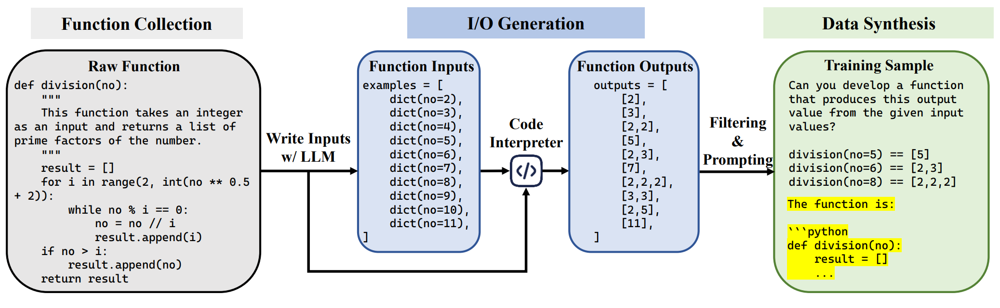

# Case2Code: Scalable Synthetic Data for Code Generation

This repository contains the code for our paper "[Case2Code: Scalable Synthetic Data for Code Generation](https://arxiv.org/pdf/2407.12504)". The Case2Code synthetic framework incorporates an LLM and a code interpreter to construct Case2Code training samples at scale automatically.



## Download Processed Dataset
You can Download our processed training Case2Code dataset used in our main experiments from huggingface: [fnlp/case2code-data](https://huggingface.co/datasets/fnlp/case2code-data).

The test set of Case2Code is available at `dataset/test.jsonl`.

## Evaluation on Case2Code test set
We provide the code to evaluate the performance of a code model on the Case2Code test set. 
1. Follow the instructions in the [vllm repository](https://docs.vllm.ai/en/stable/serving/openai_compatible_server.html) to start a OpenAI Compatible Server.
2.  Run the following command to generate inputs for each test programs, by making inference requests to the vllm server.
```bash
export DATA_FILE=dataset/test.jsonl
export MODEL_NAME=internlm2-chat-7b
export TASK=trace2code_test_baseline

python mp_run_api_local.py --data $DATA_FILE --model $MODEL_NAME --now case2code_eval --task $TASK --use_chat 1 --n_workers 32 --temp 0.0 --top_p 0.95 --max_tokens 2048 --debug 0 --api_base 'http://localhost:20240/v1'
```

3. Run the following command to evaluate the performance of a code model on the Case2Code test set by executing the generated code and comparing the outputs.
```bash
export DATA_FILE=dataset/test.jsonl
export MODEL_OUTPUT=dataset/case2code_eval/trace2code_test_baseline/xxx.jsonl

python mp_test_case2code_with_exe.py --data $DATA_FILE --model_output $MODEL_OUTPUT --output result/case2code_eval/model_eval_result/ --n_workers 4
```


## Generating New Data
We provide the code to generate new Case2Code data samples from raw code pretraining data. You can follow the steps below to synthesize new data samples.
Few samples of the intermediate data generated during the process is provided in the `dataset/case2code/` directory for referece.

### Install Requirements
```bash
pip install -r requirements.txt
```

### Prepare Pretraining Data
We provide some examples in the `dataset/raw_data.jsonl` file to demonstrate the data format for generating case2code data. You can use any code pretraining dataset and convert to the corresponding data format before starting Case2Code data samples genration. 

### Generate Inputs Using LLM
We use a server-client architecture to generate inputs using vllm. You can follow the steps below to generate inputs from code samples.
1. Follow the instructions in the [vllm repository](https://docs.vllm.ai/en/stable/serving/openai_compatible_server.html) to start a OpenAI Compatible Server.
2. Run the following command to generate inputs, by making inference requests to the vllm server.
```bash
export DATA_FILE=dataset/raw_data.jsonl
export MODEL_NAME=internlm2-chat-7b
export TASK=write_testcase

python mp_run_api_local.py --data $DATA_FILE --model $MODEL_NAME --now case2code --task $TASK --use_chat 1 --n_workers 32 --temp 0.2 --top_p 0.95 --max_tokens 2048 --debug 0 --api_base 'http://localhost:8000/v1'
```
3. The generated inputs will be saved in the `dataset/case2code/write_testcase/` directory.

### Generate Outputs Using Code Interpreter
Next, we use the code interpreter to generate outputs based on the generated inputs, and filter out the invalid samples.
1. Run the following command to generate outputs using the code interpreter.
```bash
export INPUT_FILE=dataset/case2code/write_testcase/xxx.jsonl
export OUTPUT_FILE=dataset/case2code/generate_outputs/xxx.jsonl
python mp_exec_code.py --input $INPUT_FILE --output $OUTPUT_FILE --n_workers 4
```
2. Run the following command to filter out the invalid samples.
```bash
export INPUT_FILE=dataset/case2code/generate_outputs/xxx.jsonl
export OUTPUT_FILE=dataset/case2code/filtered/xxx.jsonl
python filter_code_from_exec.py --input $INPUT_FILE --output $OUTPUT_FILE
```

### Construct Case2Code Samples
Finally, we construct the Case2Code samples by combining the inputs, outputs and the corresponding code samples, which can be used for training or evaluation of code models. 

Run the following command to construct the Case2Code samples.
```bash
export INPUT_FILE=dataset/case2code/filtered/xxx.jsonl
export OUTPUT_FILE=dataset/case2code/prompted/xxx.jsonl
python prompt_code_data.py --input $INPUT_FILE --output $OUTPUT_FILE
```

## Citation
If you find our work useful, please consider citing our paper.
```
@article{shao2024case2code,
  title={Case2Code: Scalable Synthetic Data for Code Generation},
  author={Shao, Yunfan and Li, Linyang and Ma, Yichuan and Li, Peiji and Song, Demin and Cheng, Qinyuan and Li, Shimin and Li, Xiaonan and Wang, Pengyu and Guo, Qipeng and others},
  journal={arXiv preprint arXiv:2407.12504},
  year={2024}
}
```
